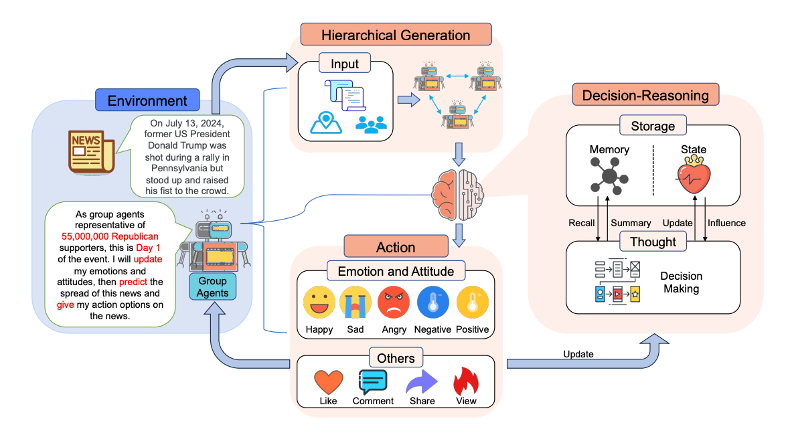

<p align="center">
  
</p>

<h1 align="center"><strong>GA-S<sup>3</sup>: Comprehensive Social Network Simulation with Group Agents</strong></h1>

<p align="center">
  <em>Accepted by ACL 2025 Findings</em>
</p>

<p align="center">
  🎉 <strong>We have open-sourced the runnable codebase of GA-S<sup>3</sup>.</strong>
</p>

---

GA-S<sup>3</sup> is a comprehensive social network simulation system built around newly designed Group Agents.
Unlike conventional agent systems that simulate one individual at a time, our Group Agents represent collections of individuals with similar online behaviors, making large-scale and realistic social simulation possible at manageable computational cost.

In this release, we open-source:

- 📦 Codebase
- 🧠 Group agent generation modules
- 🌐 Social environment configuration
- 🔧 benchmark-compatible simulation pipeline


<p align="center">
  
</p>

---

## 🚀 Set-up

Install the dependencies:

```bash
pip install -r requirements.txt
```

Then check the examples in:

- [`config/settings.example.yaml`](./config/settings.example.yaml)

Copy `config/settings.example.yaml` to `config/settings.yaml`, then fill in your own model configuration and runtime settings there.
In particular, please provide your own dataset file path in `dataset_path`.

---

## ▶️ Run

After configuration is ready, simply run:

```bash
python main.py
```

---

## 📈 Analysis

After execution, all outputs will be written to the event-specific directory under [`results/`](./results), for example:

- `results/event_7/`

---

### 📚 Citation

If you use GA-S³ in your work, please cite us:

```bibtex
@inproceedings{zhang-etal-2025-ga,
    title = "$GA-S^3$: Comprehensive Social Network Simulation with Group Agents",
    author = "Zhang, Yunyao  and
      Song, Zikai  and
      Zhou, Hang  and
      Ren, Wenfeng  and
      Chen, Yi-Ping Phoebe  and
      Yu, Junqing  and
      Yang, Wei",
    editor = "Che, Wanxiang  and
      Nabende, Joyce  and
      Shutova, Ekaterina  and
      Pilehvar, Mohammad Taher",
    booktitle = "Findings of the Association for Computational Linguistics: ACL 2025",
    month = jul,
    year = "2025",
    address = "Vienna, Austria",
    publisher = "Association for Computational Linguistics",
    url = "https://aclanthology.org/2025.findings-acl.468/",
    doi = "10.18653/v1/2025.findings-acl.468",
    pages = "8950--8970",
    ISBN = "979-8-89176-256-5",
    abstract = "Social network simulation is developed to provide a comprehensive understanding of social networks in the real world, which can be leveraged for a wide range of applications such as group behavior emergence, policy optimization, and business strategy development. However, billions of individuals and their evolving interactions involved in social networks pose challenges in accurately reflecting real-world complexities. In this study, we propose a comprehensive $S$ocial network $S$imulation $S$ystem ($GA\\text{-}S^3$) that leverages newly designed $G$roup $A$gents to make intelligent decisions regarding various online events. Unlike other intelligent agents that represent an individual entity, our group agents model a collection of individuals exhibiting similar behaviors, facilitating the simulation of large-scale network phenomena with complex interactions at a manageable computational cost. Additionally, we have constructed a social network benchmark from 2024 popular online events that contains fine-grained information on Internet traffic variations. The experiment demonstrates that our approach is capable of achieving accurate and highly realistic prediction results."
}
```
